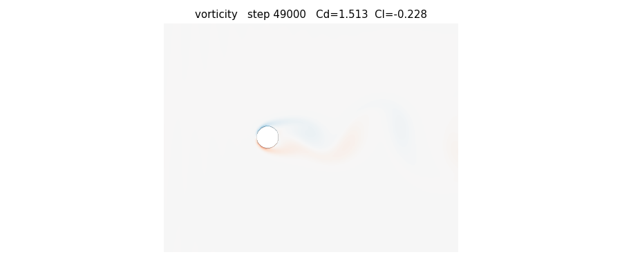
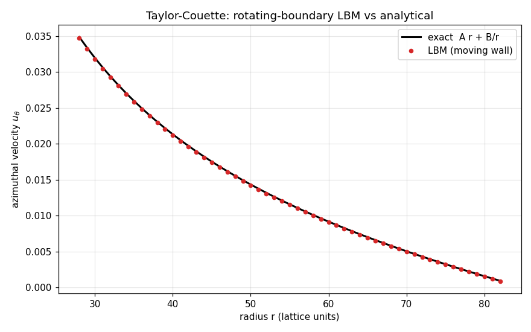

# FluidSim

**A free, open-source GPU wind tunnel for the RC community.**

Drop in an `.stl` of your design and watch your GPU simulate the airflow around
it in real time — the actual flow (wakes, vortices, pressure) plus the numbers
that matter (lift, drag, thrust, efficiency). Built for **RC airplanes, RC
helicopters, and multirotor drones** alike.

> **Status: early development.** The physics core is being built and validated
> from the ground up. It is not yet a usable end-user app — see
> [Roadmap](#roadmap). What works today is a validated 2D reference solver,
> including the hard part: rotating boundaries.

---

## Why this exists

If you design your own RC aircraft, your options for seeing how air actually
flows over it are poor:

- **Cloud CFD** (SimScale, AirShaper) — paid, not real-time, runs on someone
  else's servers.
- **Free hobbyist tools** (XFLR5, OpenVSP) — can't ingest an arbitrary 3D-printed
  STL, and can't resolve the swirling wake behind a spinning prop or rotor.
- **The one capable free GPU engine** (FluidX3D) — licensed for non-commercial
  use only, with no friendly UI or hobbyist analytics.

**Nothing free combines all of:** drop-in STL · real-time GPU flow ·
hobbyist-friendly · planes *and* helis *and* drones · lift/drag/thrust readouts.
That is the gap FluidSim aims to fill — under a permissive MIT license, free for
everyone, forever.

## How it works

FluidSim uses the **Lattice Boltzmann Method (LBM)** — a CFD approach whose local,
grid-based math maps naturally onto thousands of GPU cores. Arbitrary geometry is
voxelised onto the lattice, so any STL can be simulated directly, and forces on
the body are recovered by momentum exchange at the surface (the basis for lift,
drag and thrust).

## Validation

The reference solver is checked against problems with known answers before
anything is built on top of it.

**Kármán vortex street** (flow past a cylinder, Re=100) — reproduces the correct
shedding frequency (Strouhal number), confirmed by two independent measurements:



**Rotating-boundary physics** (Taylor–Couette flow) — the make-or-break feature
for simulating spinning props and rotors. The moving-wall solver matches the
exact analytical velocity profile to **0.29% RMS error** across the annulus:



## Roadmap

- [x] 2D Lattice Boltzmann reference solver (CPU, NumPy)
- [x] Surface force extraction (lift / drag / thrust) — validated
- [x] Rotating / moving boundaries — validated vs analytical
- [ ] Schäfer–Turek (DFG) exact benchmark — absolute-accuracy check
- [ ] Sweeping rotating geometry with re-voxelisation (true spinning blade)
- [ ] GPU port for real-time performance
- [ ] 3D + STL import + voxelisation
- [ ] Real-time interactive flow visualisation
- [ ] Per-domain analytics (planes / helis / drones)

## Running the reference solver

Requires Python 3 with NumPy and Matplotlib (`pip install -r requirements.txt`).

```bash
python validate_cylinder.py          # Kármán vortex street + drag/Strouhal
python validate_taylor_couette.py    # rotating-boundary validation
python validate_dfg.py               # Schäfer-Turek benchmark
```

Output (vorticity frames, plots, data) is written to `out/`.

## License

[MIT](LICENSE) — free for any use, including commercial.
