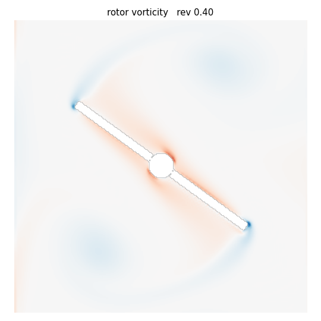
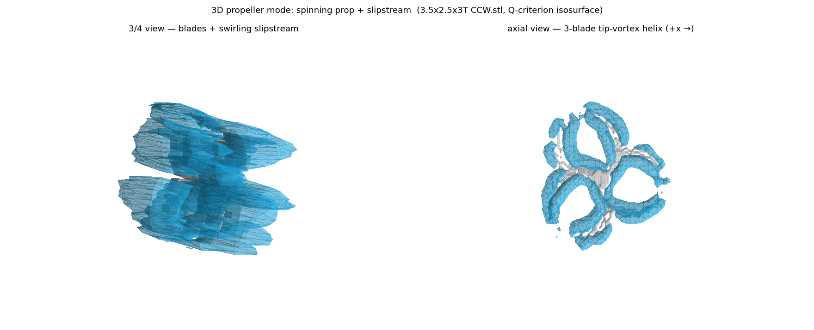
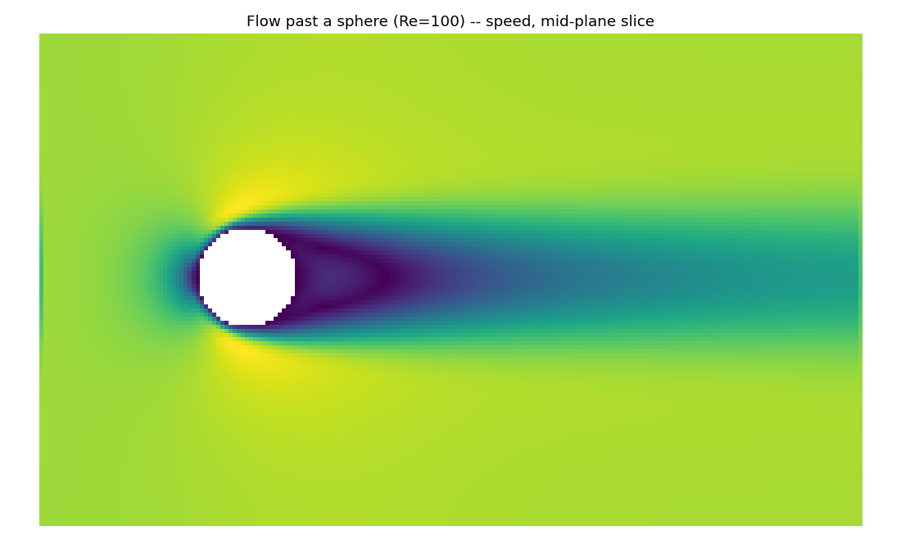
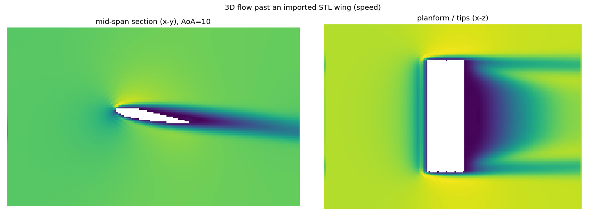

# FluidSim

**A free, open-source GPU wind tunnel for the RC community.**

Drop in an `.stl` of your design and watch your GPU simulate the airflow around
it in real time — the actual flow (wakes, vortices, pressure) plus the numbers
that matter (lift, drag, thrust, efficiency). Built for **RC airplanes, RC
helicopters, and multirotor drones** alike.

> **Status: working tool, honest about its limits.** Validated 2D + 3D GPU
> solvers, STL import, a real-time interactive 3D viewer, and a high-accuracy
> batch mode. It is **excellent for flow visualisation and comparing designs**,
> and quantitatively trustworthy for bluff-body / attached flows — with its one
> hard limit (absolute accuracy on transition-dominated low-Re airfoils) stated
> plainly. See [Accuracy](docs/VALIDATION.md).

## Quick start

Requires an NVIDIA GPU (Blackwell/RTX 50-series and others).

```bash
pip install -r requirements.txt -r requirements-gpu.txt

python fluidsim.py gui                   # the desktop app  ← start here
python fluidsim.py gui    myplane.stl    # open straight into your model
python fluidsim.py gui    myprop.stl     # (switch to Propeller mode to spin it)
python fluidsim.py report myplane.stl    # headless: run + print drag / forces
python fluidsim.py validate              # run the validation suite
```

**The desktop app** is a native window with the live GPU flow embedded, with two
modes you switch between at the top of the panel:

- **Wind tunnel** — import an STL, watch the vortices form as you orbit the
  camera, and **turn the model in the wind** with the pitch and yaw sliders (or
  by dragging it) while the **wind-speed** slider and the live lift / drag / L-D
  update the flow.
- **Propeller** — load a prop STL and **spin it on the spot**: the blades
  physically sweep the grid, flinging a swirling slipstream. **Any prop STL is
  auto-oriented** (the shaft is detected and aligned to the spin axis, so it
  never tumbles end-over-end), with **CW/CCW direction** and **flip-over**
  toggles. Sliders for rotation speed and flight speed (**0 = static / hover**),
  a **lift & efficiency** readout (thrust, figure of merit, lift-per-power, shaft
  power) plus advance ratio / swirl / tip Mach, and a one-click **performance
  sweep** (hover lift-vs-RPM or cruise vs advance ratio) that saves the curves.

Dark, clean, and built for tinkering. (`python fluidsim.py view` is a lighter
chrome-free viewer if you prefer.)

---

## Why this exists

If you design your own RC aircraft, your options for seeing how air actually
flows over it are poor:

- **Cloud CFD services** — paid, not real-time, and run on someone else's
  servers rather than your own GPU.
- **Free hobbyist aero tools** — generally can't ingest an arbitrary 3D-printed
  STL, and can't resolve the swirling wake behind a spinning prop or rotor.
- **High-end GPU CFD engines** — typically restrictively licensed and aimed at
  experts, with no friendly UI or hobbyist analytics.

**Nothing free combines all of:** drop-in STL · real-time GPU flow ·
hobbyist-friendly · planes *and* helis *and* drones · lift/drag/thrust readouts.
That is the gap FluidSim aims to fill — under a permissive MIT license, free for
everyone, forever.

## How it works

FluidSim uses the **Lattice Boltzmann Method (LBM)** — a CFD approach whose local,
grid-based math maps naturally onto thousands of GPU cores. Arbitrary geometry is
voxelised onto the lattice, so any STL can be simulated directly, and forces on
the body are recovered by momentum exchange at the surface (the basis for lift,
drag and thrust).

📖 **For the full picture — the goal, the tech stack, and the math we're building
from scratch — see [docs/OVERVIEW.md](docs/OVERVIEW.md).**

## Validation

The reference solver is checked against problems with known answers before
anything is built on top of it.

**Kármán vortex street** (flow past a cylinder, Re=100) — reproduces the correct
shedding frequency (Strouhal number), confirmed by two independent measurements:


**Rotating-boundary physics** (Taylor–Couette flow) — the make-or-break feature
for simulating spinning props and rotors. The moving-wall solver matches the
exact analytical velocity profile to **0.29% RMS error** across the annulus:


**A true spinning rotor** — geometry that physically sweeps the grid
(re-voxelised every timestep). A two-blade rotor flings tip vortices into still
fluid and spins it up, stably, over many revolutions:



**Propeller mode on a real imported prop** — a 3.5″ three-blade prop STL,
auto-oriented and spun in the 3D CUDA solver. Left: the swirling slipstream.
Right: looking down the shaft, the three tip-vortex helices of the spinning
blades (Q-criterion isosurface; `render_prop.py`):



**3D flow past a sphere** (Re=100) — the 3D D3Q19 solver, validated against the
Schiller–Naumann drag correlation (Cd 1.21 vs 1.09 reference; the excess is
expected staircasing at this resolution). Steady separated wake, mid-plane slice:



**End-to-end: a wing from an STL file, in 3D flow** — imported mesh → GPU
voxelisation → 3D flow. Mid-span section (left) and planform/tips (right):



## Roadmap

**Physics & geometry foundation — complete and validated:**

- [x] 2D Lattice Boltzmann solver (D2Q9) — CPU & GPU (NumPy/CuPy, identical code)
- [x] Surface force extraction (lift / drag / thrust) — DFG benchmark exact
- [x] Rotating / moving boundaries — validated vs analytical (0.29% RMS)
- [x] Sweeping rotating geometry (true spinning blade) — angular-momentum budget
- [x] GPU solver — validated to machine precision vs CPU; 10–23× and scaling
- [x] 2D airfoil polar harness (NACA 0012)
- [x] **3D solver (D3Q19)** — validated vs sphere drag (Cd 1.21 vs 1.09)
- [x] **STL import + voxelisation** — IoU 0.93 vs analytic; end-to-end STL→3D flow

**The road to a usable tool:**

- [x] **Native-CUDA fused kernel** — one-pass stream+collide+bounce-back+BC
      (CuPy `RawKernel`, sm_120). ~3000 MLUPS on an RTX 5070 Ti, **50× over the
      CuPy backend**, field-matched to the reference (0.24% RMS). Real-time 3D at
      useful resolution (256³ ≈ 180 steps/s) is now reachable.
- [ ] Further kernel tuning (FP16 + single-buffer esoteric-pull) for the last ~3×
- [x] 3D vortex visualisation — Q-criterion vortex-core isosurfaces (`render_3d.py`)
- [x] **Real-time interactive 3D viewer** (`live_viewer_3d.py`) — orbit/zoom
      around an imported wing while the GPU simulates; live vortex-core
      isosurfaces (the wingtip vortices), VTK-rendered
- [x] Force/torque in the CUDA path (validated 0.25% vs reference) + live Cl/Cd/L-D
      in the 3D viewer HUD; 3D finite-wing polar (lift slope matches theory)
- [x] Regularised collision + Smagorinsky LES — stable into the RC regime
      (2D to Re 40k, 3D to Re 20k; BGK dies ~Re 1–2k). Matches BGK at low Re.
- [x] **Propeller mode** — a spinning STL in the 3D CUDA solver: the blades
      physically sweep the lattice (pre-rotated mask bank + moving-wall
      bounce-back + fresh-cell refill), validated stable over many revolutions
      with a steady swirling slipstream and a well-defined reacted torque
      (`validate_prop.py`). Wired into the GUI as a mode toggle.
  - [x] **Auto-orientation** — any prop STL is rotated into the solver's frame by
        detecting the shaft as the mesh's thinnest principal axis, so it spins
        flat instead of tumbling; with CW/CCW direction and flip-over (handedness-
        preserving) controls. CPU regression in `test_orient.py`.
  - [x] **Performance readout & sweeps** — operating-point metrics (thrust,
        figure of merit, lift-per-power, C_T/C_P, cruise efficiency η, advance
        ratio) and one-click hover (lift-vs-RPM) / cruise (vs-J) performance
        curves (`sweep_rpm`/`sweep_j`, `demo_prop_sweep.py`).
  - [x] **Static / hover stability** — a non-reflecting anti-bounce-back pressure
        outlet (gated to static; cruise keeps the validated outflow) fixes the
        closed-tank blow-up, so the prop runs at J=0 across the RPM range.
  - [ ] **Absolute hover figure-of-merit** — *not yet physical.* The non-reflecting
        outlet gives **stability**, but a fixed-velocity inlet **starves the disk**
        (steady-state FM lands low ~3–5%); a true entrainment inlet makes the
        two-pressure-boundary system ill-posed. Needs a larger domain + far-field
        (characteristic) BCs. Tracked in **[docs/PROP_NOTES.md](docs/PROP_NOTES.md)**.
      - *Robust: shaft power, torque, C_P, swirl, and trends. Estimated (low-Re
        force caveat, for comparison only): thrust, C_T, η, figure of merit,
        lift-per-power. See VALIDATION.md and PROP_NOTES.md.*
- [ ] Polish the renderer (volume smoke, surface pressure, live AoA/wind controls)
- [ ] Per-domain dashboard (planes / helis / drones)
- [x] **Native-CUDA 2D kernel** (`lbm2d_cuda.py`) — ~31,000 MLUPS, ~400× CuPy;
      BGK + LES; the resolution unlock for accurate high-Re airfoils
- [x] **Validation vs real wind-tunnel data** (UIUC E387, Re=100k): high
      resolution recovered camber lift (0→+0.20) and halved drag error
      (4.4×→2.1×) — real measured progress, **not yet trustworthy** (see VALIDATION.md)
- [x] Attempted to close the E387 gap — and mapped the real frontier. A
      transported-intermittency transition model (`transition.py`) was built and
      proven *ineffective by architecture* (gating LES eddy viscosity can't move
      the resolved separation). A high-accuracy batch mode (`batch_accuracy.py`,
      near-DNS + time-averaging) is **grid-converged at Cl 0.38 (−52%)** for the
      airfoil: 2D spuriously stalls transitional low-Re airfoils, and 3D-DNS
      (~10⁸–10⁹ cells) won't fit 16 GB. **Honest conclusion: trustworthy absolute
      low-Re airfoil lift is beyond this tool; it excels at flow visualisation,
      trends/comparison, and bluff-body / attached-flow accuracy.** (VALIDATION.md)
- [x] **High-accuracy batch mode** (`batch_accuracy.py`) — near-DNS + time-
      averaging + grid-convergence check; trustworthy for the validated regimes
      (bluff bodies, attached flows), with the airfoil-transition limit stated

See **[docs/VALIDATION.md](docs/VALIDATION.md)** for the full accuracy results so
far, and an honest account of what has *not* yet been validated.

## Running the reference solver

Requires Python 3 with NumPy and Matplotlib (`pip install -r requirements.txt`).

```bash
python validate_cylinder.py          # Kármán vortex street + drag/Strouhal
python validate_taylor_couette.py    # rotating-boundary validation
python validate_dfg.py               # Schäfer-Turek benchmark
python demo_rotor.py                 # spinning rotor (sweeping geometry)
python demo_airfoil.py               # NACA 0012 lift/drag polar sweep
python gpu_benchmark.py              # GPU vs CPU: correctness + speed-up
python live_viewer.py                # REAL-TIME interactive wind tunnel (GPU)
python validate_sphere.py            # 3D solver: flow past a sphere (Re=100)
python demo_stl_flow.py              # 3D: import an STL wing, flow past it
python validate_cuda.py              # fused CUDA kernel: correctness + ~3000 MLUPS
python render_3d.py                  # 3D vortex-core isosurface render (still)
python live_viewer_3d.py             # REAL-TIME interactive 3D wind tunnel
python demo_wing_analytics.py        # 3D finite-wing polar (Cl/Cd/L-D)
python validate_collision.py         # BGK vs regularised+LES stability ceiling
python validate_e387.py              # vs REAL UIUC E387 wind-tunnel data
python validate_prop.py              # spinning prop: stable slipstream + torque
python render_prop.py                # 3D still: spinning prop + slipstream wake
python demo_prop_sweep.py --mode hover   # prop performance map (hover lift / cruise)
python test_orient.py                # prop auto-orientation regression (CPU, no GPU)
```

### Live interactive viewer

`live_viewer.py` opens a real-time window: a NACA 0012 airfoil in a live wind
tunnel running on the GPU. **Tilt the wing with the arrow keys and watch the flow
separate and stall**, with lift/drag updating live. Controls: ↑/↓ angle of attack,
←/→ wind speed, `f` cycle field (vorticity/speed/pressure), `space` pause, `r`
reset, `q` quit.

For the GPU backend (NVIDIA): `pip install -r requirements-gpu.txt`, then pass
`array_module=cupy` when constructing the solver. The GPU runs the identical
code and is validated to match the CPU reference to machine precision.

Output (vorticity frames, plots, data) is written to `out/`.

## License

[MIT](LICENSE) — free for any use, including commercial.
